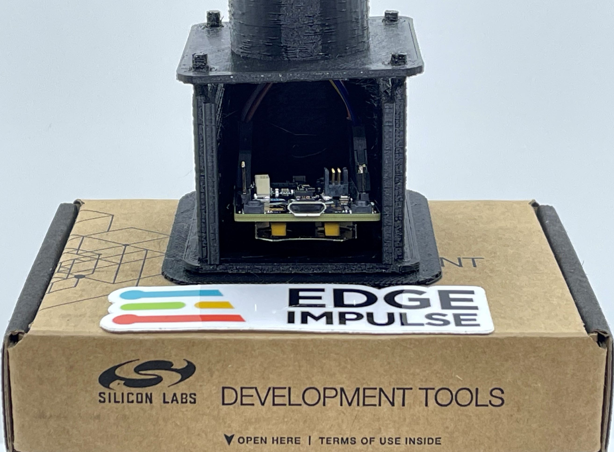
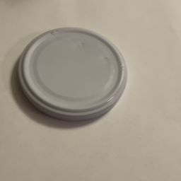
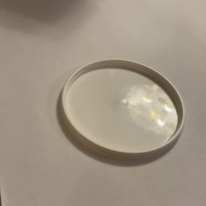
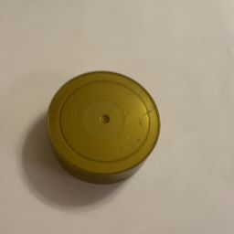
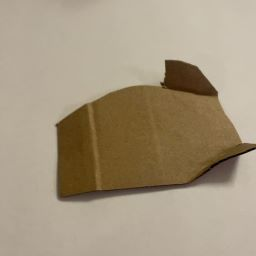
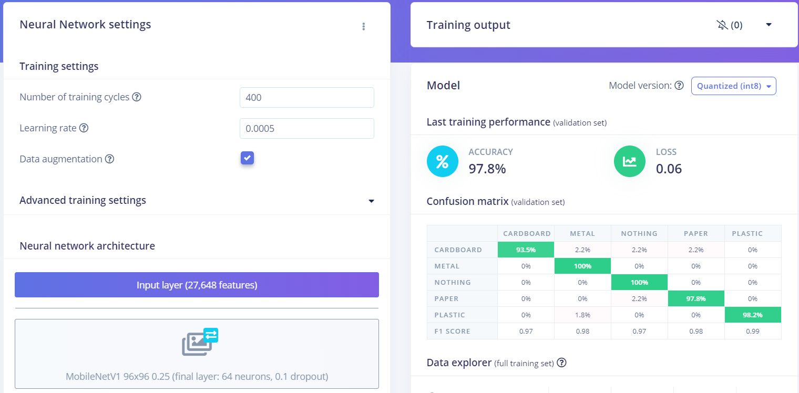
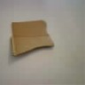
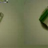
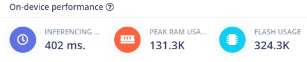

# Playing Poker at the Edge, Part 2 of 2

# Introduction

In this tutorial you will learn how you can sort playing cards using a *real* robot arm and TinyML (Tiny Machine Learning) running on an development board officially supported by Edge Impulse, but also how the concept easily can be adapted to e.g. sorting solid waste. 

In [Part 1](https://docs.edgeimpulse.com/experts/prototype-and-concept-projects/silabs-xg24-card-sorting-and-robotics-1) you learned how to classify the playing cards themselves according to their colour, and so this tutorial will focus more on interpreting and utilising the signals provided by the xG24 board to control the robot. It is thus recommended to at least browse through Part 1 before reading Part 2.

Hardware used in this tutorial is the aforementioned [SiLabs xG24 Dev board](https://www.silabs.com/development-tools/wireless/efr32xg24-dev-kit?tab=overview) as well as the [Dobot Magician](https://www.dobot-robots.com/products/education/magician.html) robot arm. However, any other Python-programmable robot arm can most probably be adapted to work according to the steps in this tutorial. 

**Photo of Arducam + xG24 + Dobot**

# Use-case Explanation

Sorting cards with a robot arm - in this case somewhat slowly - might not be that useful in practice. Nevertheless, it serves as a starting point into TinyML, robotics, and binds them together with quite straightforward Python programming. Poker playing cards were chosen as they are lightweight and uniform in size, making them optimal to start with. 

In the second part of this tutorial you will learn how to adapt the card sorting solution to sorting waste into different piles. This is not a new idea, Google recently announced having performed a [large scale waste sorting experiment](https://ai.googleblog.com/2023/04/robotic-deep-rl-at-scale-sorting-waste.html) with a fleet of 23 robots using reinforcement learning. Another quite similar approach as used in this tutorial was made by [Peter Ma in 2018](https://www.hackster.io/Nyceane/trash-and-recyclable-sorting-robot-arm-975282). He also used the Dobot Magician robot arm, but with a Raspberry Pi 3 and an Intel Movidius Neural Compute Stick.

Due to the serious issues the climate change is causing our planet, we need to take many actions to mitigate or at least reduce the effects from our overconsumption of resources. One of these actions is to sort and recycle as much as possible at the source, but also sort the inevitable remaining waste into metals, plastics, bio-waste, etc. for proper recycling or transformation into energy. 

Obviously a robot arm for educational use cannot be used for industrial usage, but the general ideas learned through these two tutorials can be applied for up-scaling of sorting e.g. non-defective and defective products on a conveyor belt, unripe and ripe fruits, waste etc.  

# Components and Hardware Configuration

## Hardware Used:
* [SiLabs xG24-DK2601B EFR32xG24 Dev Kit](https://www.silabs.com/development-tools/wireless/efr32xg24-dev-kit?tab=overview)
* [Arducam B0067 2MP OV2640 SPI Camera for Arduino](https://www.welectron.com/Arducam-B0067-2MP-OV2640-SPI-Camera-for-Arduino_1)
* [Pin Header 2.54mm 1x20 Pin](https://www.welectron.com/Pin-Header-254mm-1x20-Pin) for soldering to the SiLabs board
* [Dobot Magician](https://www.dobot-robots.com/products/education/magician.html) robot arm
* 3D-printer to print protective case and stand (Optional)

## Configure the Hardware
* For details about configuring SiLabs and Arducam, check [tutorial 1](https://docs.edgeimpulse.com/experts/prototype-and-concept-projects/silabs-xg24-card-sorting-and-robotics-1#configure-the-hardware) 
* No special configuration is needed for the robot arm, this tutorial is however based on the suction cup being installed. 
* The devices are connected through USB-cables, and using serial communication: `Robot arm  <==>  Computer  <==>  SiLabs & Arducam`

# Data Collection Process

As this project is partly a continuation of part one, please see the [Data Collection Process](https://docs.edgeimpulse.com/experts/prototype-and-concept-projects/silabs-xg24-card-sorting-and-robotics-1#data-collection-process) for how *poker card data* was collected. 
For *waste data* same principles were used, where I used a mobile phone camera for most of the images taken, and the device itself (xG24 + Arducam) for some additional images.

## Software and Hardware Used to Capture Data:

* [Edge Impulse Studio & CLI (Command-Line Interface)](https://www.edgeimpulse.com/)
* SiLabs xG24 was used for ~10 % of the data
    * to use this with Edge Impulse, you first need to flash the Edge Impulse firmware, detailed steps are found in the [documentation](https://docs.edgeimpulse.com/docs/development-platforms/officially-supported-mcu-targets/silabs-xg24-devkit)
* mobile phone camera (iPhone 12) was used for ~90 % of the data

 **Also here I noticed that the initial model performance in real situations, and when using the xG24-device was far from perfect** 

## Steps to Reproduce

* Please see [part one](https://docs.edgeimpulse.com/experts/prototype-and-concept-projects/silabs-xg24-card-sorting-and-robotics-1#steps-to-reproduce) for detailed steps how to collect images when using a mobile phone and when using the xG24-device and Arducam.

## Collecting Images of Nonuniform Waste Material

It is relatively easy to develop a very robust ML-model when using poker playing cards as they are uniform in size and have very good contrast. The same does however not apply when it comes to waste as waste comes in many different forms, colours, and sizes. For example, metal can be shining and reflective, but when painted might look very similar to plastic. When looking at these pictures, perhaps you can guess which lids are made of metal, and which of plastic? 

 

*Answer: The first one is made of metal, the others of plastic.*

Also, poker cards barely cause any shadows at all, but most waste material produce - depending on the light conditions - shadows, which can confuse a ML-model. For example, how can you know if the ML-model really is "seeing" the object itself, or only focusing on the  shadows it's causing? For this reason, I tried to vary the light conditions when collecting images by using different artifical light sources. In addition, I also collected some images using daylight (not easy in Finland in February with very short days...).

The objects used in this project were chosen so that they could be lifted with the robot's suction cup, thus they could not be of any size, form, or weight. I decided to collect images of four types of objects: paper, cardboard, metal, and plastic. In addition, I also collected images where none of the objects where present, in practice mainly of the table I'd put the objects on. For sure, sorting solid waste into only four classes might not be enough in a real scenario, obviously this is depending on the country and city where you live. At my workplace e.g., we sort using six bins: plastic, glass, metal, paper, cardboard, and biowaste. 

I ended up with a total of 1353 images, very evenly divided into the five classes. Out of these images, I used the xG24-device and Arducam only for a few tens, as it takes so much more time to collect images compared to using a mobile phone camera. But even these few images made a difference, making the final model performing better!

# Building, Training, and Testing the Model
After you've collected some data, you need to build and train the model. The main steps in this process are to create an impulse, extract features, and finally train the model. Again, with image classification and when using Edge Impulse, this is often pretty straightforward.

## Steps to Reproduce

The steps to build, train, and test the model are close to identical as [the ones in part 1](https://docs.edgeimpulse.com/experts/prototype-and-concept-projects/silabs-xg24-card-sorting-and-robotics-1#steps-to-reproduce-1), with the following comments:

* Also here, I knew beforehand that the 256 kB RAM memory would put some constraints on what model configuration to use. Following that, I chose to use an image size of 96x96 pixels when creating the impulse, and MobileNetV1 when later training the model.
* Instead of using `Resize mode:` `Squash` as with the poker cards, I used the default `Fit shortest axis`, although I doubt it matters much in this type of project.
* After having trained with a few different configurations, I found that `MobileNetV1 96x96 0.25 (final layer: 64 neurons, 0.1 dropout)` gave most bang for the buck.

* The trained model has an accuracy of 97.8 % which is actually quite good with this relatively sparse data. When looking at the few images it classified incorrectly, one can also understand why some of them can be challenging to predict.
* It might be a coincidence, but all mispredicted images were taken using the Arducam. It has lower image quality than a modern mobile phone camera, and also needs more light to produce decent image quality, so this is something to consider when using Arducam.

| Image                     | Label       | Predicted              |
| -----------               | ----------- | -----------            |
|    | paper       | nothing (= table)      |
|| cardboard   | paper                  |
|  | plastic     | metal                  |
|| cardboard   | metal                  |

* In this project I later used [EON Tuner](https://docs.edgeimpulse.com/docs/edge-impulse-studio/eon-tuner) to search for a more optimal model, but as RAM memory is the main constraint when running ML on xG24, I could not use any of the suggested MobileNetV2 models. 
* The estimated inference time on the xG24 device is quite similar as in part one

# Model Deployment
Go into detail about the process of getting your resulting model into your application and onto your hardware.  This will of course vary by the target hardware, but explain what is occurring and how to flash your firmware, import the model if it’s a Linux device, or include a Library directly in your application.  Again describe the options presented to a user, and explain why you make the selections you do.  A few screenshots of the process would be useful.

# Results
Now it is time to show the finished project, deployed and running on the device.  Let’s talk about the results of running the model, presenting data, evidence, or statistics as appropriate.  Not all projects may meet their objectives, or perform well, but we should still present the outcomes truthfully.  If the project was extremely successful, then we can articulate on how the project could be scaled to truly make an impact.  If the project fell short of its goal, that is fine as well, and we can discuss what might have gone wrong, how the project could be improved, and provide lessons learned.  Screenshots or images might be needed here, as well.  

# Conclusion
A brief summary recapping what you built, why, and the outcome you achieved.  A few sentences wrapping up the project, any next steps you might take, or giving advice to the reader on how they can take your project and replicate it as-is, iterate, expand, or even scale your work.  All Expert Projects should be Public Projects, so explain that a reader can Clone your work and has access to your data, model, and can review the steps you took.  Reinforce the human health or machine health use case, and provide any final links or attribution.  

# D O N E

# Intro / Overview
Briefly provide an introduction to your project. Address the following: what you are accomplishing, what the intended outcome is, highlight the use-case, describe the reasons for undertaking this project, and give a high level overview of the build. Provide a sentence or two for each of these aspects.  
Summarize the problem you are addressing in one or two sentences, and how your solution makes an impact.  Be sure to also give a brief introduction to the hardware you have chosen and any key features, or reasons why the selected hardware is a good fit for your project. 
Include a high-quality image of the hardware.

# Problem Being Solved / Use-case Explanation
Here we will go deeper into the problem that is being addressed.  We’ll want to provide evidence and data that the problem exists, and provide some possible improved outcomes and what we are hoping to achieve.  We need to establish credibility and demonstrate competence and innovation, so that readers have trust in the solution being presented.  This could be a good place to also further document the hardware features, sensors, or interfaces available on the board, describe what they do or what data they are intended to capture, and why that is important.  An image further detailing the problem or challenge would be useful, but might not be required depending upon the project.

# Components and Hardware Configuration
If any additional components are needed to build the project, include a list / Bill of Materials.  Normally this is formatted in a bulleted list, and quantity needed, to build the project.  After that, a description of how to set up the hardware, attach any sensors or secondary devices, flash any firmware or operating systems, install needed applications, and ultimately reach a point where we’re ready for Edge Impulse in the project.  We’ll definitely want some pictures of the hardware build process, showing the journey and setup that will guide readers through the process.

# Data Collection Process
Next we need to describe to a reader and demonstrate how data is collected.  Depending upon the type of the project, this might be done directly in the Edge Impulse Studio, via the use of a 3rd-party dataset, or data could be collected out in the field and later uploaded / ingested to Edge Impulse.  Data being captured should be explained, the specific process to capture it should be documented, and the loading of the data into Edge Impulse should be articulated as well.  Images will be helpful here, showing the device capturing data, or if you are making use of a pre-made dataset then you will need to describe where you acquired it, how you prepared the dataset for Edge Impulse, and what your upload process entails.  Pictures of the data capture and/or screenshots of loading the data will be needed.

# Training and Building the Model
Similar to the Data Collection Process section, a thorough description of the process used to build and train a model is important, so that readers can follow along and replicate your work.  Describe the elements in the Studio, the actions you take, and why.  Talk about the need for Training and Testing data, and when creating an Impulse,  Processing and Learning block options, Feature generation, and algorithm selection (FOMO, MobileNet, Yolo, etc) available to train and build the model.  Explain the selections you make, and the reasoning behind your choices.  Again images should be used here, screenshots walking a user through the process are very helpful.